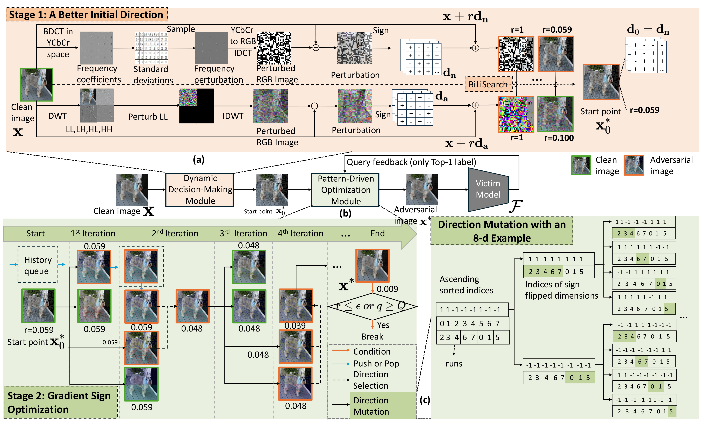

# DPAttack

This repository provides the implementation of the paper accepted at USENIX Security 2026:

> **[Low-Cost Hard-Label Adversarial Attack with Theoretical Foundations](https://www.usenix.org/conference/usenixsecurity26/presentation/liu-jun)**

It contains the code, scripts, and instructions needed to reproduce the main experimental results reported in the paper. 

DPAttack is a query-efficient untargeted hard-label adversarial attack. It is evaluated against ImageNet classifiers, CLIP zero-shot classification on ObjectNet, real-world image classification APIs, Blacklight defense, adversarially trained models, and dense prediction tasks.

> **Note:** Please download the latest code and datasets from our [Zenodo repository](https://zenodo.org/records/20322561). **Please do not download or use the files directly from GitHub**, as the Zenodo version contains the latest release.

<p align="center">
  
</p>

<p align="center">
  <em>Overview of the DifAttack++ framework.</em>
</p>

---

## Table of Contents

- [Quick Start / Minimum Working Example](#quick-start--minimum-working-example)
- [Hardware and Runtime Requirements](#hardware-and-runtime-requirements)
- [Software Environment](#software-environment)
- [Code Structure](#code-structure)
- [Dataset Preparation](#dataset-preparation)
  - [ImageNet](#imagenet)
  - [ObjectNet](#objectnet)
  - [COCO](#coco)
  - [SA-1B / SAM](#sa-1b--sam)
  - [CIFAR-10](#cifar-10)
  - [ImageNet-C](#imagenet-c)
  - [PathMNIST](#pathmnist)
- [Reproducing Main Experimental Results](#reproducing-main-experimental-results)
  - [Table 3: Untargeted Attack Performance on ImageNet](#table-3-untargeted-attack-performance-on-imagenet)
  - [Table 4: Untargeted Attack Performance on ObjectNet](#table-4-untargeted-attack-performance-on-objectnet)
  - [Table 5: Untargeted Attack Performance on Real-World APIs](#table-5-untargeted-attack-performance-on-real-world-apis)
  - [Table 6: Untargeted Attack Performance on Adversarially Trained WideResNet](#table-6-untargeted-attack-performance-on-adversarially-trained-wideresnet)
  - [Table 7: Untargeted Attack Performance on Blacklight](#table-7-untargeted-attack-performance-on-blacklight)
  - [Table 8: Untargeted Attack Performance on Dense Prediction Tasks](#table-8-untargeted-attack-performance-on-dense-prediction-tasks)
  - [Table 9: Ablation Studies](#table-9-ablation-studies)
- [Analysis Results](#analysis-results)
- [Additional Results in Appendix and Rebuttal](#additional-results-in-appendix-and-rebuttal)
- [Acknowledgments](#acknowledgments)

---


## Quick Start / Minimum Working Example

For a lightweight functionality check that typically finishes within 5 minutes, we provide a self-contained CIFAR-10 Quick Start package:

```text
CIFAR10_QuickStart.tar.gz
```

After downloading the artifact, unzip this package:

```bash
tar -xzf CIFAR10_QuickStart.tar.gz
cd CIFAR10_QuickStart
```

This package contains the CIFAR-10 quick-start script, a small CIFAR-10 test subset, the required VGG-16-BN and ResNet-18 checkpoints, Docker configuration files, and lightweight dependency specifications. Reviewers can build the Docker image and directly run the CIFAR-10 Minimum Working Example to verify the environment, model loading, and DPAttack pipeline. Detailed Docker/Conda commands and expected outputs are provided in `CIFAR10_QuickStart/README_quickstart.md`.

---

## Hardware and Runtime Requirements

Our experiments were primarily conducted on a single NVIDIA RTX A6000 GPU with 48GB VRAM. This is the hardware used in our experiments, not a strict minimum requirement.


### Recommended Hardware

| Setting | Observed Usage | Recommended Hardware |
|:--|:--|:--|
| CIFAR-10 Quick Start/MWE | <1GB GPU VRAM, <1GB RAM | ≥4GB GPU VRAM, ≥8GB RAM |
| Standard ImageNet classifiers | <2GB GPU VRAM, around 2GB RAM | ≥4GB GPU VRAM, ≥16GB RAM |
| CLIP-based classification | up to around 14GB GPU VRAM, around 2GB RAM | ≥16GB GPU VRAM, ≥16GB RAM |
| Large-scale / full experiments | depends on datasets, baselines, and models | ≥32GB RAM recommended |

For example, in our setup, ConvNeXt-Base used approximately 1.9GB system RAM. Among the classification experiments, CLIP-based attacks had the largest GPU memory footprint, requiring around 14GB GPU VRAM. Most other classification settings require substantially less GPU memory than CLIP.

### Runtime Notes

Running the full experimental suite, including all datasets, victim models, baselines, defense evaluations, commercial API experiments, and dense prediction tasks, is time-consuming and may take several days depending on hardware, query budgets, dataset availability, API rate limits, and whether all baselines are rerun.

For this reason, we provide the CIFAR-10 Quick Start/MWE for quick environment verification, together with separate scripts for reproducing individual tables and figures.

---

## Software Environment

We recommend using Python 3.11.

The complete environment used in our experiments is listed in:

```text
py311_20260517.yaml
```

A typical setup is:

```bash
conda env create -f tools/py311_20260517.yaml
conda activate py311
```

Alternatively, users may install the required packages manually based on the import statements in each script. Some versions in `py311_20260517.yaml` may not be fully compatible with every local CUDA/PyTorch setup, so please adjust them as needed.

---

## Code Structure

The repository is organized as follows:

- `Ours*.py`: main DPAttack implementations, including fixed-block-size, DBS, CIFAR-10, $\ell_2$, Blacklight, and RAND-defense variants.
- `attackAPIs/`: scripts for real-world API experiments.
- `attackSAM/` and `objectDetectionAttack.py`: dense prediction experiments on SAM and object detection.
- `baselines/`: baseline attack implementations and wrappers.
- `tools/`: shared utilities for data processing, model loading, BDCT/DCT operations, BFS analysis, gradient analysis, curvature estimation, and plotting.
- `data/`: expected dataset directory structure and auxiliary dataset files.
- `models/`: model definitions or checkpoint-related files.
- `requirement.txt` / `py311_20260517.yaml`: dependency specifications.

---

### Main DPAttack Scripts

- `Ours.py`  
  Implements DPAttack with a fixed block size. This script is used to reproduce **Ours_opt**, where the block size is manually set to the best-performing value for each setting.

- `OursDBS.py`  
  Implements DPAttack with **Dynamic Block Size Selection (DBS)**. This script is used to reproduce **Ours_dyn** results on ImageNet, ImageNet-C, ObjectNet, PathMNIST, adversarially trained models, and CLIP-based classification.

- `OursCifar10DBS.py`  
  CIFAR-10-specific version of DPAttack with DBS. 

- `OursL2.py` and `OursDBSL2.py`  
  Implements the $\ell_2$ version of DPAttack.

### Defense Evaluation Scripts

- `OursBlacklight.py`  
  Evaluates DPAttack against the Blacklight stateful defense.

  - `--defense 1 --adaptive 2` reproduces the defended setting with randomized Gaussian-noise (--randtype 2) or Uniform-noise (--randtype 1) injection.
  - `--defense 0 --adaptive 0` disables the additional noise injection strategy and evaluates the original DPAttack directly against Blacklight.

- `OursBlacklightOpt.py`  
  Fixed-block-size version for Blacklight experiments, corresponding to **Ours_opt**.

- `OursBlacklight_CERTA.py` and `OursDBS_RandPreandPost.py`  
  Evaluates DPAttack against Blacklight, RAND pre-processing or post-processing defenses, under the setting used by *Certifiable Black-Box Attacks with Randomized Adversarial Examples: Breaking Defenses with Provable Confidence* (CCS 2024).


### Dense Prediction Scripts

- `objectDetectionAttack.py`  
  Evaluates DPAttack on object detection tasks using MS-COCO dataset.

- `attackSAM/`  
  Contains scripts for attacking SAM on SA-1B dataset. This folder requires cloning the [DarkSAM](https://github.com/CGCL-codes/DarkSAM.git) repository and following its setup instructions.

### API Attack Scripts

- `attackAPIs/`  
  Contains scripts for attacking real-world commercial image classification APIs, including Baidu, Tencent, Imagga, and Google.

  Before running these scripts, users must obtain their own API credentials and configure them in:

  ```text
  attackAPIs/apis.py
  ```

### Baselines

- `baselines/`  
  Contains implementations or wrappers for baseline hard-label black-box attacks, including ADBA, RayS/HRayS, HSJA, BounceAttack, TtBA, SurFree, TangentAttack and CGBA(-H).

  For TangentAttack, clone the official repository first:

  ```bash
  cd baselines
  git clone https://github.com/machanic/TangentAttack.git
  ```

### Analysis and Utility Code

- `tools/`  
  Contains utilities for dataset preparation, model loading, BFS analysis, BDCT frequency statistics, gradient analysis, cosine-similarity tracking, curvature estimation, and plotting.


---

## Dataset Preparation


### ImageNet

We provide an example test set with 500 images in `TestImages.tar.gz`.

To use it, extract the archive and move the extracted `val` directory to:

```text
data/imagenet/val
```

For the full ImageNet validation set, please follow the same directory structure. You can download the dataset from the ⁠[ImageNet website](https://www.image-net.org/download.php).

Note: If you use the imagelist_final2000 variable to randomly select a different starting image, you need to download more images than those included in the current TestImages.tar.gz.


### ObjectNet

We provide 500 test samples in `TestImages.tar.gz`.

To use them, extract the archive and move the extracted `objectnet_sample` directory to:

```text
data/objectnet/objectnet_sample
```

For the full ObjectNet dataset, please download it from the [ObjectNet website](https://objectnet.dev/download.html)⁠ and follow the same directory structure.

### COCO

You can download MS-COCO `val2017` from [this website](https://www.kaggle.com/datasets/awsaf49/coco-2017-dataset).


### SA-1B / SAM

For SAM attacks, clone DarkSAM into the `attackSAM/` folder:

```bash
cd attackSAM
git clone https://github.com/CGCL-codes/DarkSAM.git
```

Then follow the DarkSAM instructions to download the SA-1B dataset and SAM model weights.


### CIFAR-10

Use `tools/utils.py` and call:
```python
getCifar10Testdata()
```
to organize the CIFAR-10 test data.
Alternatively, you can use the sample data provided in `CIFAR10_QuickStart/data/cifar10`.

### ImageNet-C

You can download ImageNet-C from [here](https://zenodo.org/records/2235448).
Then you need to place it under `data/imagenetc`.


### PathMNIST


The checkpoint used in our PathMNIST experiments is already provided in our repository at `models/pmnist`. They are trained following the [official MedMNIST repository](https://github.com/MedMNIST/MedMNIST).

---

## Reproducing Main Experimental Results

Unless otherwise specified, keep the default parameters in each Python file unchanged. The query budget can be changed using the corresponding `--budget` or `--maxquery` argument.

---

### Table 3: Untargeted Attack Performance on ImageNet

#### Ours_dyn

```bash
python OursDBS.py 
```
By default, the script runs the Ours_dyn attack on 200 ImageNet test images against ResNet-50 with a query budget of 50.
#### Ours_opt

Manually set the block size to the optimal value:

```bash
python Ours.py 
```
By default, the script runs the Ours_opt attack on 200 ImageNet test images against ResNet-50 with a query budget of 50, using the empirically optimal fixed block size of 8.
#### ADBA

```bash
python baselines/ADBA.py
```
By default, the script runs the ADBA attack on 200 ImageNet test images against ResNet-50 with a query budget of 50.

#### Other Baselines

Specify the attack method with `--attack_method`:

```bash
python baselines/attack_imagenet_others.py --attack_method rays 
```
By default, the script runs the HRayS attack on 200 ImageNet test images against ResNet-50 with a query budget of 50.

---

### Table 4: Untargeted Attack Performance on ObjectNet

#### Ours_dyn

```bash
python OursDBS.py --datasource objectnet --victimmodel clip
```

#### Ours_opt

```bash
python Ours.py --datasource objectnet --victimmodel clip --blocksize 4 
```

#### ADBA

```bash
python baselines/ADBAObjectNetClip.py
```

#### Other Baselines

Set the variable `attack_method` in `baselines/attack_objectnet_others.py`, then run, e.g.:

```bash
python baselines/attack_objectnet_others.py --attack_method rays
```

---

### Table 5: Untargeted Attack Performance on Real-World APIs

This experiment evaluates attacks on Baidu, Tencent, Imagga, and Google APIs.

Before running the scripts in `attackAPIs/`, users must:

1. Request API keys and secret keys from the corresponding API platforms.
2. Set these variables in:

```text
attackAPIs/apis.py
```

#### Ours_dyn

```bash
python attackAPIs/main_oursDBS.py --apitype baidu
```

#### Ours_opt

```bash
python attackAPIs/main_ours.py --apitype baidu
```

#### ADBA

```bash
python attackAPIs/main_ADBA.py --apitype baidu
```

---

### Table 6: Untargeted Attack Performance on Adversarially Trained WideResNet

Run the following command to install robustness library from the upstream GitHub repository using
```bash
pip install "git+https://github.com/MadryLab/robustness.git"
```
as `pip install robustness` may be incompatible with recent versions of `torchvision`.

Our victim model `models/wide_resnet50_2_linf_eps8.0_imgnet.ckpt` is downloaded from [ImageNet Linf-norm (ResNet50) $\ell=8/255$](https://www.dropbox.com/s/yxn15a9zklz3s8q/imagenet_linf_8.pt?dl=0). 

#### Ours_dyn

```bash
python OursDBS.py --datasource imagenet --victimmodel wrs50 --budget 1000
```

#### Ours_opt

```bash
python Ours.py --datasource imagenet --victimmodel wrs50 --budget 1000 --blocksize 16
```

#### ADBA

```bash
python baselines/ADBA.py --datasource imagenet --victimmodel wrs50 --defense 0 --budget 1000
```

#### Other Baselines

```bash
python baselines/attack_imagenet_others.py --attack_method rays --targetn wrs50 --defense 0 --maxquery 1000
```

---

### Table 7: Untargeted Attack Performance on Blacklight

#### Ours_dyn

```bash
python OursBlacklight.py
```

By default, the script is configured with the following parameters: -\-defense 1 -\-adaptive 2 -\-randsigma 0.2 -\-randsigmabottom 0.2 -\-randtype 1 -\-victimmodel vit -\-budget 100.


To evaluate the original DPAttack directly against Blacklight without noise injection:

```bash
python OursBlacklight.py --defense 0 --adaptive 0 --victimmodel vit --budget 100
```

#### Ours_opt

```bash
python OursBlacklightOpt.py  --blocksize 4
```
By default, the script is configured with the following parameters: -\-defense 1 -\-adaptive 2 -\-randsigma 0.1 -\-randsigmabottom 0.2 -\-randtype 1 -\-datasource imagenet -\-victimmodel vit -\-budget 100

Larger values of `randsigma` and `randsigmabottom` generally improve evasion against the defense by increasing query diversity, but may reduce ASR because the injected noise can weaken the original attack direction.

#### ADBA

```bash
python baselines/ADBA.py --defense 1 --budget 100 --victimmodel vit
```

#### Other Baselines

```bash
python baselines/attack_imagenet_others.py --defense 1 --attack_method rays --targetn vit --maxquery 100
```

---

### Table 8: Untargeted Attack Performance on Dense Prediction Tasks

#### 1. Object Detection on COCO

Download COCO `val2017` following the above instruction and run the corresponding setting below.

##### Ours_dyn

Set `attack_method = "Oursdy"` in `objectDetectionAttack.py`, then run:

```bash
python objectDetectionAttack.py --onlyone 0
```

##### Ours_opt

Set `attack_method = "Ours"` in `objectDetectionAttack.py`, then run:

```bash
python objectDetectionAttack.py --onlyone 0 --blocksize 4
```

##### Ours_dn

Set `attack_method = "Ours"` in `objectDetectionAttack.py`, then run:

```bash
python objectDetectionAttack.py --onlyone 1 --blocksize 8
```

##### ADBA

Set `attack_method = "ADBA"` in `objectDetectionAttack.py`, then run:

```bash
python objectDetectionAttack.py
```

#### 2. SAM on SA-1B

Enter the `attackSAM/` directory and follow the DarkSAM setup. Then run

##### Ours_dyn

```bash
python main.py --test_method OursDy --onlyone 0
```

##### Ours_opt

```bash
python main.py --test_method Ours --onlyone 0 --blocksize 4
```

##### Ours_dn

```bash
python main.py --test_method Ours --onlyone 1 --blocksize 4
```

##### ADBA

```bash
python main.py --test_method ADBA
```

---

### Table 9: Ablation Studies

Ablation studies are mainly conducted using `OursAblationInit.py`, `Ours.py`, and `OursDBS.py`.

#### Initialization Ablation in `OursAblationInit.py`

With PDO search, set `--ablation` to:

| Value | Initialization |
|:--:|:--|
| `2` | Uniform |
| `3` | Gaussian |
| `4` | $d_b$ |
| `5` | $d_r$ |
| `6` | Another image |

With dyadic fixed binary search, set `--ablation` to:

| Value | Initialization |
|:--:|:--|
| `21` | Uniform |
| `31` | Gaussian |
| `41` | $d_b$ |
| `51` | $d_r$ |
| `61` | Another image |

#### Ours_dn + PDO

```bash
python Ours.py --ablation 0 --victimmodel vit --blocksize 4 --onlyone 1 --budget 500
```

#### Ours_dn + ADBA Search

```bash
python Ours.py --ablation 1 --victimmodel vit --blocksize 4 --onlyone 1 --budget 500
```

#### DDM + PDO

```bash
python OursDBS.py --ablation 0 --victimmodel vit --onlyone 0 --budget 500
```

#### DDM + ADBA Search

```bash
python OursDBS.py --ablation 1 --victimmodel vit --onlyone 0 --budget 500
```

---

## Analysis Results

This section describes how to reproduce the analysis figures and theoretical validation results.

### Fig. 3: BFS Analysis

Generate and save perturbed images:

```bash
python baselines/attack_imagenet_others.py --attack_method BFS --targetn Resnet50
```

Draw BFS curves:

```python
# In tools/OursAnalysis.py
analyzeDCTSensitivity()
```

---

### Fig. 4: Clean Image Frequency Statistics

```python
# In tools/OursAnalysis.py
analyzeCleanBDCT()
```

---

### Table 1: Pearson Correlation Analysis

First run the BFS analysis and clean-image frequency-statistics analysis above. Then run:

```python
# In tools/OursAnalysis.py
pearson()
```

---

### Fig. 5: Gradient Analysis

#### Fig. 5(a): Cosine Similarity Between True Gradient Sign and Block-Wise Averaged Approximations

Obtain the true gradient:

```bash
python baselines/attack_imagenet_others.py --attack_method fgsmgrad
```

Generate gradient spatial-prior analysis:

```python
# In tools/OursAnalysis.py
gradSpatialPrior()
```

Draw the figure:

```python
# In tools/OursAnalysis.py
visgradSpatialPrior_bar()
```

#### Fig. 5(b): Cosine Similarity Between True Gradient Sign and Initialization Directions

```python
# In tools/OursAnalysis.py
compareInitGradCossim()
```

---

### Table 2: Curvature Estimation

Clone PyHessian:

```bash
git clone https://github.com/amirgholami/PyHessian.git
```

Then:

1. Follow the PyHessian installation instructions.
2. Place `tools/Hessian.py` in the downloaded PyHessian folder.
3. Generate and save intermediate adversarial examples using query-based attack methods.
4. Run the curvature estimation code in `tools/Hessian.py`.

---

### Fig. 6: Evolution of Cosine Similarity

Generate and save cosine-similarity values.

#### Ours

```bash
python tools/OursAnalysis.py --ablation 0 --binaryAnalyze 4
```

#### Ours w/o PDO


```bash
python tools/OursAnalysis.py --ablation 1 --binaryAnalyze 4
```

#### HRayS

```bash
python baselines/attack_imagenet_others.py --attack_method rays --binaryAnalyze 1
```

#### ADBA

```bash
python baselines/ADBA.py --binaryAnalyze 7
```

Generate the evolution plot:

```python
# In tools/OursAnalysis.py
cossimEvo()
```

---

### Fig. 7: Empirical Validation of Theorem 5

```python
# In tools/OursAnalysis.py
callTheorem5()
```

---

## Additional Results in Appendix and Rebuttal

### Additional Ablation Study

Use `Ours.py`.

Search method:

| Argument | Meaning |
|:--:|:--|
| `--ablation 0` | PDO search |
| `--ablation 1` | Dyadic fixed binary search / ADBA search |

Initialization method:

| Argument | Meaning |
|:--:|:--|
| `--onlyone 0` | DDM |
| `--onlyone 1` | $\mathbf{d_n}$ |
| `--onlyone 2` | $\phi(\mathbf{d_r})$ |


---

### CIFAR-10 Results

First organize CIFAR-10 test data by calling:

```python
# In tools/utils.py
getCifar10Testdata()
```

Then run:

```bash
python OursCifar10DBS.py
```

For ADBA:

```bash
python baselines/ADBACifar10.py
```

For other baselines:

```bash
python baselines/attack_cifar10_others.py
```

---

### $\ell_2$ Attack Results

#### Ours

```bash
python OursDBSL2.py
```

#### Other Baselines

```bash
python baselines/attack_imagenet_others.py --attack_method tangent --constraint 2 --threshold 5
```

---

### ImageNet-C

Download ImageNet-C and place it at:

```text
data/imagenetc
```

Then run:

```bash
python OursDBS.py --datasource imagenetc --victimmodel HMany
```

---

### PathMNIST

The provided checkpoint follows the MedMNIST repository and is included in this repository.

```bash
python OursDBS.py --datasource pmnist --victimmodel Net28
```

---

### Comparison with CA (CCS 2024)

This experiment follows the setting of:

> *Certifiable Black-Box Attacks with Randomized Adversarial Examples: Breaking Defenses with Provable Confidence* (CCS 2024)

Before running `OursBlacklight_CERTA.py`, clone the official CA repository:

```bash
git clone https://github.com/datasec-lab/CertifiedAttack.git
```

Then copy:

```text
CertifiedAttack/configs/attack/imagenet_blacklight/untargeted/unrestricted/resnet_CertifiedAttack.yaml
```

to:

```text
tools/resnet_CertifiedAttack_forDPAttack.yaml
```

Run the following commands to evaluate DPAttack under Blacklight, RAND post-processing, and RAND pre-processing:

```bash
python OursBlacklight_CERTA.py --defense 1 --victimmodel resnet18_cer --randsigma 0.1 --randsigmabottom 0.1 --randtype 1

python OursDBS_RandPreandPost.py --pertstage 2 --epsilon 0.12

python OursDBS_RandPreandPost.py --pertstage 1 --epsilon 0.1
```

## Citation

If you find this work useful for your research, please consider citing our paper:

```bibtex
@inproceedings {DPAttackUSENIX2026,
	author = {Jun Liu and Leo Yu Zhang and Fengpeng Li and Isao Echizen and Jiantao Zhou},
	title = {{Low-Cost} {Hard-Label} Adversarial Attack with Theoretical Foundations},
	booktitle = {35th USENIX Security Symposium (USENIX Security 26)},
	year = {2026},
	isbn = {978-1-939133-58-8},
	address = {Baltimore, MD},
	pages = {4861--4880},
	url = {https://www.usenix.org/conference/usenixsecurity26/presentation/liu-jun},
	publisher = {USENIX Association},
	month = aug
}
```


---

## Acknowledgments

This code is based in part on and modified from the [officicial ADBA implementation](https://github.com/BUPTAIOC/ADBA).


We thank the ADBA authors for their foundational implementation. Since the
original ADBA repository does not provide an explicit license file, portions
derived from ADBA remain subject to the rights of the original authors.


